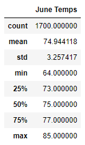
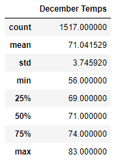

# Surfs Up

## Overview of Project

### Purpose

An investor would like to see a weather analysis of Oahu before investing in a surfing and ice cream shop to make sure it's a good business decision. I will be using SQLAlchemy to pull data from a SQLite database to analyze temperature trends.

## Results

### June and December Weather Differences

- The average temperature in June is about 4 degrees warmer than December at 75 compared to 71.
- The minimum temperature in December is 8 degrees colder at 56 compared to 64 in June.
- The maximum temperature is only 2 degrees warmer in June at 85 compared to December at 83.

## Summary

### Additional Query Recommendations

While it gets a little colder in December compared to June, the weather appears to stay in the 70s for most of the year. In order to gather more weather data for June and December there are a couple additional queries that I would perform. First, I would compare the precipitation data between the two months to see if one tends to be rainier than the other. Second, I would look at the temperature and precipitation data grouped by station to see if there is a difference between the various locations on the island.
